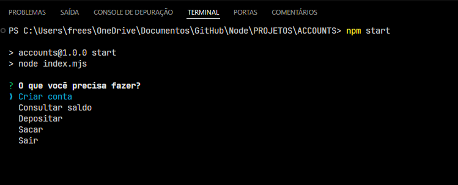

# Projeto Accounts



## Descrição

O projeto **Accounts** é um simulador de sistema bancário desenvolvido em **Node.js**. Ele permite ao usuário realizar operações bancárias básicas através do terminal. As principais funcionalidades incluem a criação de contas, consulta de saldo, depósitos e saques.

## Funcionalidades

- **Criar Conta**: Permite ao usuário criar uma nova conta com um nome personalizado.
- **Consultar Saldo**: Permite ao usuário verificar o saldo atual de uma conta existente.
- **Depositar**: Permite ao usuário adicionar um valor ao saldo de uma conta.
- **Sacar**: Permite ao usuário retirar um valor do saldo de uma conta.
- **Sair**: Encerra o programa.

## Estrutura do Código

O código é dividido em várias funções, cada uma responsável por uma operação específica. Aqui está uma explicação de como cada parte funciona:

1. **Módulos Utilizados**
   - **inquirer**: Para interagir com o usuário e obter suas respostas no terminal.
   - **chalk**: Para estilizar as mensagens exibidas no terminal.
   - **fs**: Para manipular arquivos e diretórios, essencial para armazenar as informações das contas.

2. **Função Principal**
   - A função principal apresenta um menu com as opções disponíveis (criar conta, consultar saldo, depositar, sacar, sair). Dependendo da escolha do usuário, a função correspondente é chamada.

3. **Criar Conta**
   - Solicita ao usuário um nome para a nova conta. Se o nome for fornecido, uma nova conta é criada e salva como um arquivo JSON no diretório `./accounts-bank`. Caso o diretório não exista, ele é criado.

4. **Consultar Saldo**
   - Solicita o nome da conta e lê o arquivo JSON correspondente para exibir o saldo atual. Se a conta não existir, o usuário é solicitado a tentar novamente.

5. **Depositar**
   - Solicita o nome da conta e o valor a ser depositado. Verifica se a conta existe e se o valor é válido antes de atualizar o saldo no arquivo JSON.

6. **Sacar**
   - Solicita o nome da conta e o valor a ser retirado. Verifica se a conta existe e se há saldo suficiente antes de atualizar o saldo no arquivo JSON.

7. **Sair**
   - Exibe uma mensagem de agradecimento e encerra o programa.

## Como Executar

1. **Instale as Dependências**:
   - Certifique-se de ter o [Node.js](https://nodejs.org/) instalado.
   - Clone o repositório para o seu ambiente local.
   - Instale as dependências necessárias com o comando:

     ```bash
     npm install inquirer chalk
     ```

2. **Execute o Programa**:
   - Utilize o seguinte comando para iniciar o programa:

     ```bash
     node index.mjs
     ```

3. **Interaja com o Sistema**:
   - Siga as instruções exibidas no terminal para realizar as operações desejadas.

## Contribuição

Se você deseja contribuir com melhorias ou correções, sinta-se à vontade para enviar um pull request ou abrir uma issue no GitHub.

## Licença

Este projeto está licenciado sob a [MIT License](LICENSE).
